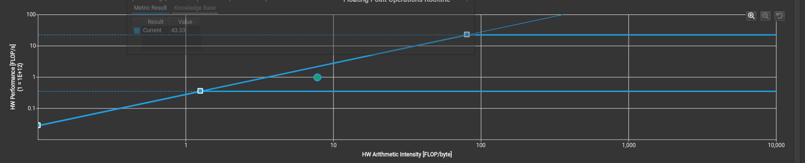
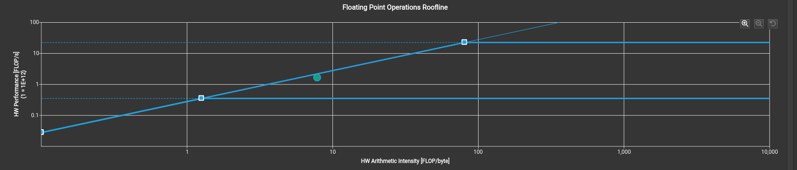
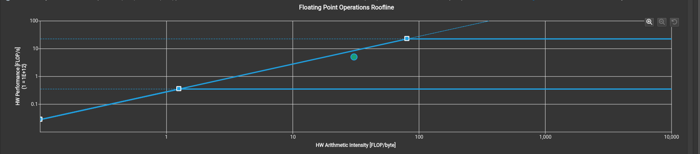

### breakdown of the profiler file

1. `01_naive.ncu-rep` - nvcc -O3 -arch=sm_89 --generate-line-info -Xptxas -v 01_naive.cu -o test

```
1. fp32 compute throughput - 4% of peak 
this means we are hardly doing any math and are bottlnecked by something else

2. compute (SM) throughput - 67% 
this is a bit weird that the compute throughput is quite decent for a dumb gemm kernel.
but check the breakdown of the compute throughput.
- the busy SM pipe is mostly Inst Executed Pipe Lsu, meaning load/store traffic. (67%)
- the second most is MIO inst issued - it counts the number of instructions issued by the GPU that go through the MIO pipeline. another memory problem. (22%)

3. warp stall cycles - every time a warp tries to run a instruction, it gets stalled
- lg throttle stalls - 48.7% of all stalls (29.1 cycles avg)
the L1 instruction queue for local/global memory is full. This means threads are firing off so many global memory loads that is piled in the queue and nothing can happen.
- long_scoreboard stalls - 39.4% of all stalls (23.6 cycles avg)
a warp is waiting for a previous global memory load to return before it can use the value. global memory latency on Ada is ~200–400 cycles but we are issuing a load and then immediately needing the result, so the warp just stalls.

4. occupancy - 98% 
even tho we have a very high occupancy, all the warps are stalled on memory.
```

also look at the roofline model, we are severly on the memory bound side, but even the memory is not being used efficiently due to memory stalls.



2. `02_gemm_coalesce.ncu-rep`

```
this is actually pretty similar to the naive version and offers no perf boost compared because our memory access is already coalesced in v1.
```

3. `03_smem.ncu-rep`

```
1. fp32 compute throughput - 7% of peak

2. compute throughput is 86% but still its the same Inst Executed Pipe Lsu that is the highest, we need the FMA to be more.

3. warp stalls - now we have gotten rid of the lg throttle completely 
- now currently the major stall is stall long scoreboard which is each warp of this workload spends 30.9 cycles being stalled waiting for a scoreboard dependency on a L1TEX (local, global, surface, texture) operation.
- we also have barrier stall because of the new __sync__ we introduced.

4. the L1 hit rate in the smem version has gone down a lot, since we unlike global memeory where we hit l1 cache each time, we moved it to shared memory.
```

also the roofline is still pretty memory bound but a bit closer to the line so better.




3. `03_smem.ncu-rep`

```
1. fp32 compute throughput - 22% of peak

2. warp stalls
- now the major stall is stall mio throttle. this stall reason is high in cases of extreme utilization of the MIO pipelines, which include special math instructions, dynamic branches, as well as shared memory instructions.
- we also have barrier stall because of the new __sync__ we introduced.

3. the L1 hit rate in the smem version is almost nothing
```

also the roofline is still pretty memory bound but a bit closer to the line so better.


