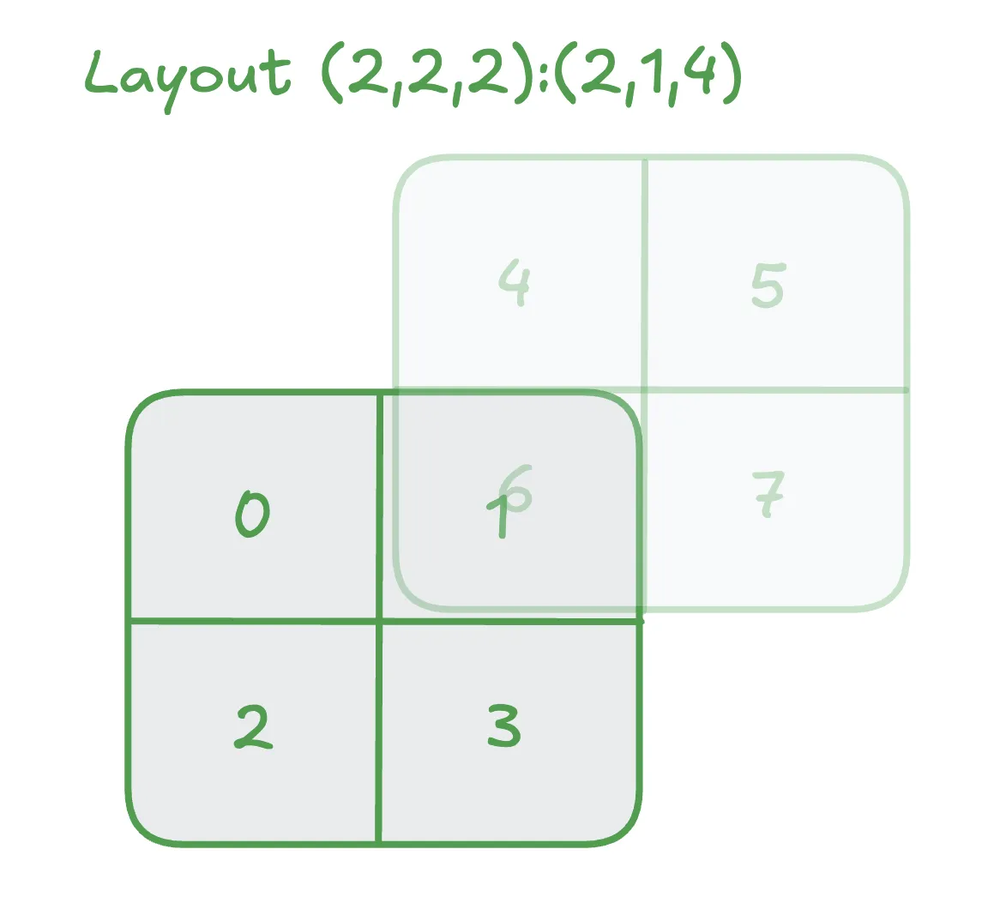
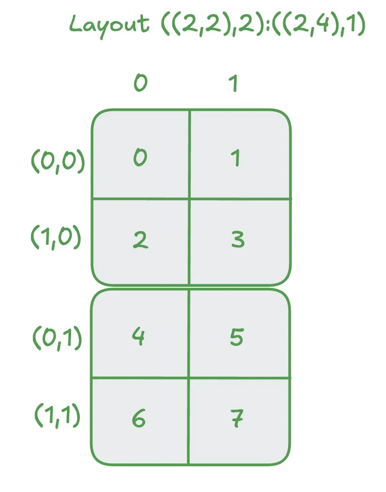
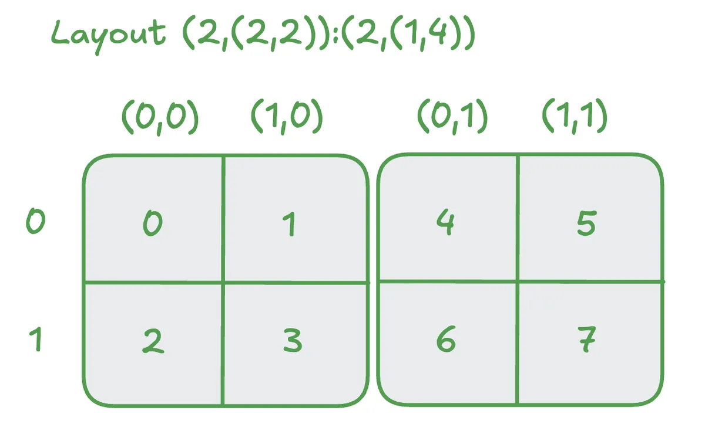

ref - https://veitner.bearblog.dev/intuition-behind-hierarchical-layouts/

1. layout 1 - (2, 2, 2) : (2, 1, 4)

we can imagine them as two planes. 

(this is K major - basicaly contigous across K dimension)

for matrix A = M x K, this mean A[m, k], A[m, k + 1] etc

for this picture 
- mode 0 = stride 2 (row)
- mode 1 = stride 1 (col)
- mode 2 = stride 4 (plane)

2. layout 2 - ( (2, 2), 2) : ((2, 4), 1)

we have two modes here -
1. mode 1 is 2 = stride 1(col)
2. mode 0 is nested (2, 2) = (2, 4) (row)

this means within the tile to go the next row, we have stride 2, to the next tile, we need stride 4

3. layout 3 - ( 2, (2, 2)) : (2, (1, 4))

1. mode 0 is 2 = stride 2 (row)
2. mode 1 is (2, 2) = (1, 4) (col)

this means within the tile to go to next col, stride 2, to the next tile column, stride 4

