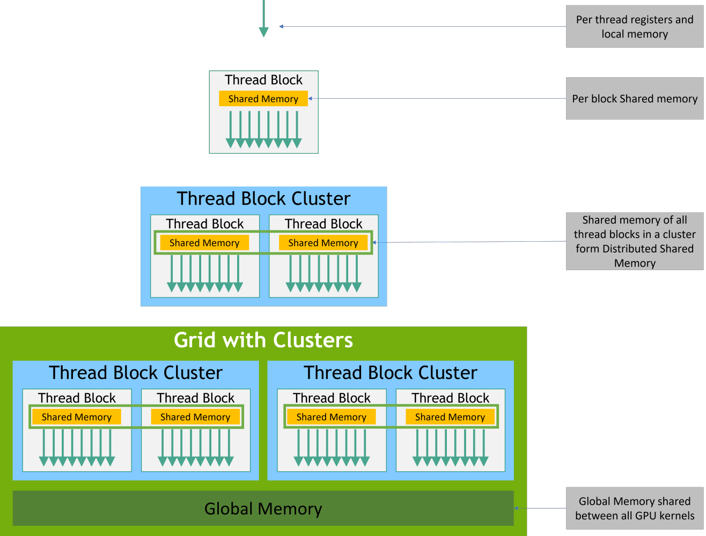

## a deep dive on hopper architecture

this article should help you get started with hopper architecture. we will mostly look at h100 as an example.

- h100 has 2 form factors - pcie and sxm. sxm has higher power (700w) and gives better performance than pcie (300w).
- 80gb HBM3 memory with peak bandwith of 3.35 tb/s
- 132 SM
- 528 tensor cores (4 per SM)
- and a lot of async features.


### some background

there are two problems with the thread block design that we have in ampere/ada architecture - 

1. a single thread block can only only a limited shared memory specific to its thread block. taking the H800 PCIe 80GB as an example, its global memory size is 80GB, while each thread block can only use a maximum of 227KB of smem. this means it can only perform a small sub task in smem and after a point you will have to use the gmem if it cant fit inside the smem.

2. low utilization rate of SMs. the max threads that can be configured for a single thread block is 1024. if each thread block processes large amounts of data and computations, and the kernel only launches a small number of thread blocks at a time, some SMs may be idle, and computational resources may not be fully utilized, thus limiting the overall performance of the kernel. for example, during decode.

so they decided to introduce thread block clusters.

### thread block clusters



a thread block cluster consists of several thread blocks called cluster size. the H100 has a maximum cluster size of 16. all threads in a cluster can access the smem distributed across different thread blocks. this Shared Memory is called Distributed Shared Memory which is just a collection of smem, its size equal to the sum of the Shared Memory sizes of all Thread Blocks. since different Thread Blocks in a Thread Block Cluster may reside on different SMs (Streaming Memory Controllers), and the L1 Cache is unique to each SM (one SM cannot access the L1 Cache of another), Distributed Shared Memory needs to use efficient memory accessible to all SMs. L2 Cache is accessible to all SMs, while Distributed Shared Memory only needs to be accessible to SMs within a single cluster. Does Hopper have a memory layer that allows access to the shared memory of all SMs within a cluster? The answer is yes. The Hopper architecture adds an SM-to-SM Network layer within the cluster, located between the L1 and L2 Caches. SMs within a Thread Block Cluster can access the shared memory of other SMs through this network. 

### problem with sync copy

check `sync_copy.cu`, even though it looks like one copy, gpu cannot directly do global to shared memory.

it becomes something like this -

1. compute global address
2. compute shared-memory address
3. LDG: load global memory into a register
4. STS: store that register into shared memory

check `sync_copy_loop.cu`, because num_per_threads is a runtime value, the compiler cannot fully specialize the loop. it ends up doing a bunch of sync global loads and shared stores being reaching sync threads.


cp.async reduces instruction overhead, avoids using registers as the data bridge, and lets the copy run asynchronously so the kernel can overlap memory movement with computation.

cuda::memcpy_async is asynchronous. when a thread issues the copy, it does not wait for the data to arrive in shared memory immediately. The thread
can continue executing later instructions. because the copy is async, plain __syncthreads() is not enough by itself to mean “the async copy has completed.” you need a synchronization object tied to the async copy. that is what cuda::barrier / mbarrier is doing.

```
cuda::memcpy_async(...);     // start global -> shared copy
// do unrelated math here while copy is in flight
barrier.arrive_and_wait();   // wait until async copy is complete
// now safely use shared memory
```

this still has a limitation where each thread still computes source and destination addresses for the copy. for complicated 2D/3D tiles, those address
calculations can be expensive. Hopper TMA improves that by letting you describe a tensor/tile layout once, then have hardware move a whole tile with less per thread address calculation.

### TMA

regardless of being sync or async copies, copying large blocks of video memory involves splitting them into several smaller blocks and using loops and multiiple threads to complete the copying of these smaller blocks. each copy requires calculating the starting address of the video memory which cannot be overlapped by asynchronous copies, and the number of computational instructions increases linearly with the number of smaller video memory blocks. the reason for explicitly calculating addresses is mainly due to address discontinuities. for example, in matrix multiplication, when dividing global memory into blocks and loading each small block into shared Memory, the addresses of different rows within the video memory block are not contiguous and need to be calculated manually.

to solve this problem, the Hopper architecture introduced the TMA feature. TMA supports the following functions -
1. bulk asynchronous memory copy - uses the cuda::memcpy_async. Similar to memcpy on the CPU, this supports copying an entire block of memory, reducing the number of copy instructions.
2. multi dimensional memory block copying  - this supports copying non-contiguous multi-segment memory blocks. In practical use, it's necessary to distinguish between one-dimensional and multi-dimensional memory block copying. Multi-dimensional memory block copying requires calling the cuTensorMapEncode API on the host side to calculate the address mapping relationship between memory blocks. Then, it's passed to the Kernel function via a CUtensorMap type parameter annotated with __grid_constant__, calling TMA's asynchronous copy interface to complete the multi-dimensional copy. 
3. supports asynchronous copying from Shared Memory to Global Memory . The Ampere architecture only supports asynchronous copying from Global Memory to Shared Memory, while the Hopper architecture supports reverse copying operations, improving the kernel's read and write performance across different storage structures.

From a hardware perspective, the TMA resides within the SM, with each SM having its own dedicated TMA. The TMA controls the loading of data from the SMEM into registers, where the tensor core or CUDA core performs the computation.

From a software perspective, unlike synchronous and asynchronous modes, TMA's model transfer is performed using a single thread. data transfer is automatically handled by TMA, and the thread can be used for other purposes.

### gpu organization

the full die is divided into -

1. nvidia gigathread engine - distributes thread blocks (ctas) to sms
2. 8 GPC (graphics processing clusters) - each containing 18 sms
3. HBM3 memory stacks - 5 active stacks (6th disabled for manufacturing yield)
4. HBM3 memory controllers - 10 independent 512-bit controllers
5. pcie 5.0 host interface - the highway that connects cpu to gpu
6. nvlink switches/ports/hub - high speed gpu-to-gpu fabric
7. L2 cache slices - 50 mb total, partitioned across gpcs


### gigathread engine

the gigathread engine is the hardware dispatcher for kernel launches. it -
(cta is also thread block)
1. tracks ctas that are pending, running, or finished
2. assigns ctas to SM when they have available capacity
3. an SM can only hold so many thread blocks at once depending on how many registers and how much shared memory the kernel uses. the gigathread engine knows this and won't overschedule.


### TMA (tensor memory accelerator)

before TMA (pre-hopper), loading data from global memory to shared memory was the programmer's problem. every thread had to compute its own index, figure out its row offset, handle boundary checks, and then issue the load. for a 2d tile this means you'd write something like `smem[threadIdx.y][threadIdx.x] = gmem[row * stride + col]` and every thread in the warp is doing this in lockstep, which wastes execution cycles that could be spent on math.

with TMA, you describe the data movement once using a tensor descriptor which is a small metadata object you create on the cpu that says "here's the base pointer, here's the shape, here's the stride between rows." then at runtime, a single thread in the warp fires off one tma instruction: "go fetch a 128x64 tile from coordinate (x, y) and drop it into this shared memory address." that's it. the other 31 threads in the warp don't need to participate at all and they're immediately free to do something else while the tma hardware handles everything in the background.


### 4th generation tensor core

1. 4 tensor cores per SM, 528 total across the chip.
2. introduces wgmma (warpgroup matrix multiply accumulate) — in previous generations (ampere and before), a single warp of 32 threads issued a `wmma` instruction to do a small matrix multiply. the operands were small enough to fit in registers owned by those 32 threads. hopper changes this: now a warp group where 4 warps working together, 128 threads total  issues a single `wgmma` instruction to do a much larger matrix multiply. this matters because bigger tiles mean fewer round trips to shared memory, which means better arithmetic intensity, which means you're spending more time doing math and less time waiting on memory.
3. native fp8 support  fp8 is a new lower-precision format (8 bits vs fp16's 16 bits). you fit twice as many values in the same register space and get roughly 2x the throughput on tensor core ops compared to fp16. 


### HBM memory

1. 80 GB capacity, 3.35 TB/s bandwidth
2. divided across 5 active stacks (6th disabled for manufacturing yield)
3. 5120 bit bus width(10 * 512) that enables TMA to move 128 bytes per transaction
4. Connected via 10 independent 512-bit memory controllers

### L2 Cache

1. 50 MB total, split into two 25 MB partitions
2. the cache line is 128 bytes and the sector is 32 bytes. what does this mean? 
when the GPU looks for data, it checks if the Address is present in the cache. It doesn't track every single byte; it tracks "tags" for 128-byte chunks.
If you want to store even 1 byte in the L2 cache, you must "allocate" a full 128-byte line to hold it.

the Sector is the unit of movement. A 128-byte cache line is divided into four 32-byte sectors.
In older GPUs, if you missed the cache, you had to fetch the entire line from HBM.
In modern GPUs, the L2 can be "partially filled." If you only need data in the first 10 bytes, the hardware only fetches Sector 0 (32 bytes) from HBM3. The other three sectors in that line remain "invalid" or empty until they are actually needed. you save tons of HBm bandwith
3. Uncoalesced accesses can cause sector explosion. what does this mean lol?

Imagine a Warp (32 threads) where each thread asks for a 4-byte float. thats 32 threads x 4  bytes = 128  bytes.
These 128 bytes sit perfectly inside one cache line.The hardware performs one L2 request, fetches four sectors, and everyone is happy.

The Bad Scenario
Imagine the same 32 threads, but they are asking for data that is spread out (e.g., thread 0 asks for address 0, thread 1 asks for address 200, thread 2 asks for address 400). Even if each thread only wants 4 bytes, each of those addresses likely falls into a different cache line. The L2 now has to manage 32 different "tags" and fetch at least one 32-byte sector for each thread.
this means instead of moving 128 bytes of data to satisfy the Warp, the hardware moves 32 requests x 32  bytes = 1,024  bytes. You are now using 8x more bandwidth than necessary.


### GPC - Graphics Processing Cluster

1. it a group of 18 SMs
2. Each GPC has its own dedicated chunk of L2 cache
4. Shared Memory or the (SRAM) is private to a single SM. SM-A can directly read from SM-B. 
But with hopper,  Within a GPC, the SMs are connected by a high-speed inter-SM fabric. This allows an SM to directly "reach into" the Shared Memory of another SM in the same cluster.

### NVLink 4.0

PCIe 5.0 is more like a "slow" bridge between the CPU and the GPU, which NVLink is a "super-highway" that connects GPUs directly to other GPUs.

1. 18 NVLink 4.0 lanes that gives 900 GB/s total GPU-to-GPU bandwidth
2. Organized as 9 sub-links, each providing 100 GB/s bidirectional (50 GB/s per direction)
3. Can directly connect up to 8 GPUs
4. With NVSwitch fabric this scales up to 256 GPUs

### SM

the SM (streaming multiprocessor) is the main execution unit. each kernel's thread blocks get assigned to sms, and all the actual compute happens here. each sm contains:

- fp32 cuda cores - for standard floating point ops like add, multiply, fma
- int32 units - integer math and memory address calculations (can run simultaneously with fp32 on hopper)
- fp64 units - double precision math (h100 has full fp64 throughput for hpc workloads)
- 4th gen tensor cores - for matrix multiply operations (wgmma)
- shared memory / l1 data cache - an unified on-chip SRAM which you can split between SMEM and L1
- L1 instruction cache 
- L2 instruction cache 
- warp schedulers - select which warp to issue each cycle
- dispatch units - route the selected instruction to the right execution pipeline
- register file - 64k 32-bit registers per SM, private to each thread

each SM is divided into 4 sub-partitions (smsps). each smsp has its own warp scheduler, dispatch unit, register file partition, and execution pipelines. the 4 smsps share the l1/shared memory.


### special function units (sfus)

16 sfus per SM (4 per smsp), each capable of 1 instruction per cycle , that is 16 ops/cycle per SM.

sfus handle math like sin, cos, log, exp, sqrt, reciprocal, and rsqrt. these are operations you can't build out of a few adds and multiplies. sfus use a combination of approximations to compute these in 1-4 cycles at the cost of slightly reduced precision.


### load/store units (lsus)

32 lsus per sm (8 per smsp). these handle all memory traffic in and out of the sm:

- loads - fetch data from l1 cache, l2 cache, or global memory (hbm)
- stores - write data back to l1/l2/global memory
- atomics - read-modify-write operations like `atomicAdd`

when a warp executes a load instruction, all 32 threads have a memory address they want to read. the LSU doesn't issue 32 separate requests, instead it inspects all 32 addresses and tries to merge them into the minimum number of cache line sized transactions. if the addresses are all within the same 128-byte aligned region, that's one transaction. if they're spread across 32 different cache lines, that's 32 transactions — and you pay 32x the latency and bandwidth.


### shared memory & l1 cache

256 kb of unified on-chip sram per sm, shared between l1 data cache and programmable shared memory. you configure the split at the kernel level.
shared memory bandwidth is 33 tb/s per sm, this is ~10x HBM bandwidth.

shared memory is divided into 32 banks, each 4 bytes wide. consecutive 4-byte words map to consecutive banks. a warp can read 32 different addresses simultaneously as long as they hit 32 different banks that's one cycle, conflict-free.

bank conflicts happen when two or more threads in a warp access different addresses in the same bank. the hardware serializes those accesses  2 threads hitting the same bank = 2 cycles, 8 threads = 8 cycles

TMA async copies bypass the bank conflict problem entirely when loading from global memory into shared memory, since they write to smem directly without going through the warp's execution pipeline.

### TMA multicast

TMA multicast is useful when several CTAs in the same cluster need the same
global-memory tile. Instead of each CTA loading that tile separately, one CTA
issues a TMA load and broadcasts the result into the shared memory of multiple
CTAs in the cluster.

The example in `tma_multicast.cu` uses one cluster with 8 CTAs:

```
             n=0  n=1  n=2  n=3
m=0           0    1    2    3
m=1           4    5    6    7
```

For a GEMM-like B tile, CTAs in the same `n` column reuse the same B tile, so
the multicast groups are:

```
CTA0 -> CTA0, CTA4
CTA1 -> CTA1, CTA5
CTA2 -> CTA2, CTA6
CTA3 -> CTA3, CTA7
```

The mask is a bitmask of CTA ranks inside the cluster. With `CLUSTER_M = 2` and
`CLUSTER_N = 4`, the base column mask is:

```
col_mask = (1 << 0) | (1 << 4) = 0b00010001
```

Then each producer shifts it by its column:

```
n=0: 0b00010001 -> ranks 0,4
n=1: 0b00100010 -> ranks 1,5
n=2: 0b01000100 -> ranks 2,6
n=3: 0b10001000 -> ranks 3,7
```

The important difference from normal 2D TMA is that the destination is
`shared::cluster`, not just local `shared`, and each target CTA's barrier must
expect the incoming transaction before the CTAs wait on it.


### WGMMA

WGMMA means warp-group matrix multiply accumulate. Older `mma`/`wmma`
instructions are issued by one warp. Hopper WGMMA is issued by a warp group,
which is 4 consecutive warps, or 128 threads. The first warp in the group must
have a warp rank that is a multiple of 4.

The mental model is:

```
one warp group = 128 threads = one WGMMA participant group
```

WGMMA supports two common accumulator forms:

```
D = A * B + D
D = A * B      // accumulator input D is disabled with ScaleD = 0
```

For dense bf16/f16 input and f32 output, the instruction shape is usually:

```
m64 nN k16
```

`M` is fixed at 64, `K` is 16, and `N` is a multiple of 8. Examples:

```
m64n8k16
m64n64k16
m64n128k16
m64n256k16
```

The example in `wgmma.cu` intentionally uses the smallest useful shape:

```
wgmma.mma_async.sync.aligned.m64n8k16.f32.bf16.bf16
```

That keeps the output registers small: each of the 128 threads owns 4 `float`
accumulator registers. Larger shapes like `m64n128k16` need 64 accumulator
registers per thread.

#### operand locations

For WGMMA:

- `D` is always in registers.
- `B` must be in shared memory.
- `A` can be in registers or shared memory.

The examples here use the simpler shared/shared form:

```
A in shared memory
B in shared memory
D in registers
```

When A and B are both in shared memory, WGMMA does not receive normal pointers.
It receives encoded shared-memory descriptors:

```cpp
uint64_t desc_a = make_smem_desc(sA);
uint64_t desc_b = make_smem_desc(sB);
```

The descriptor tells WGMMA where the shared-memory tile starts, what its leading
offset is, what its stride is, and which swizzle layout is used. This matters
when TMA loads the tile. If TMA used `CU_TENSOR_MAP_SWIZZLE_128B`, the WGMMA
descriptor also needs to describe 128B swizzle. If those disagree, WGMMA reads
the wrong logical elements.

In `wgmma.cu` the descriptor is intentionally simple:

```cpp
desc |= matrix_descriptor_encode(addr);
desc |= matrix_descriptor_encode(uint64_t(16)) << 16;
desc |= matrix_descriptor_encode(uint64_t(1024)) << 32;
```

The address is encoded in 16-byte units. The example uses no swizzle so the
high swizzle bits are left as zero.

#### instruction flow

WGMMA is asynchronous, so the sequence matters:

```cpp
warpgroup_arrive();        // wgmma.fence
wgmma_m64n8k16<0>(...);    // issue async matrix multiply
warpgroup_commit_batch();  // commit issued WGMMA ops
warpgroup_wait<0>();       // wait until no WGMMA groups are pending
```

`wgmma.fence` makes the warp group's register/shared-memory inputs visible to
WGMMA before the instruction is issued.

`wgmma.mma_async` starts the tensor core operation. It does not mean the result
is immediately ready.

`wgmma.commit_group` closes the current batch of WGMMA instructions.

`wgmma.wait_group<0>` waits until all committed WGMMA work is complete before
the code reads or stores the accumulator registers.

If the data came from TMA, there is usually one more requirement before WGMMA:

```cpp
cuda::ptx::fence_proxy_async(cuda::ptx::space_shared);
```

That makes shared-memory writes performed through the async proxy visible to
the generic/WGMMA side.

#### register pressure

The output tile lives in registers. This can get expensive quickly.

For `m64n8k16`:

```
64 * 8 outputs / 128 threads = 4 floats per thread
```

For `m64n128k16`:

```
64 * 128 outputs / 128 threads = 64 floats per thread
```

For a larger block tile like `128x256`, one 128-thread warp group would need:

```
128 * 256 outputs / 128 threads = 256 accumulator floats per thread
```

That is already at the per-thread register limit before loop variables,
pointers, predicates, and temporary values. When register pressure gets too
high, the compiler spills to local memory or serializes WGMMA instructions,
which can show up as warnings like:

```
Potential Performance Loss: wgmma.mma_async instructions are serialized due to
insufficient register resources for the wgmma pipeline
```

The usual fix is to split the work across more warp groups or smaller output
tiles so each thread owns fewer accumulator registers.
