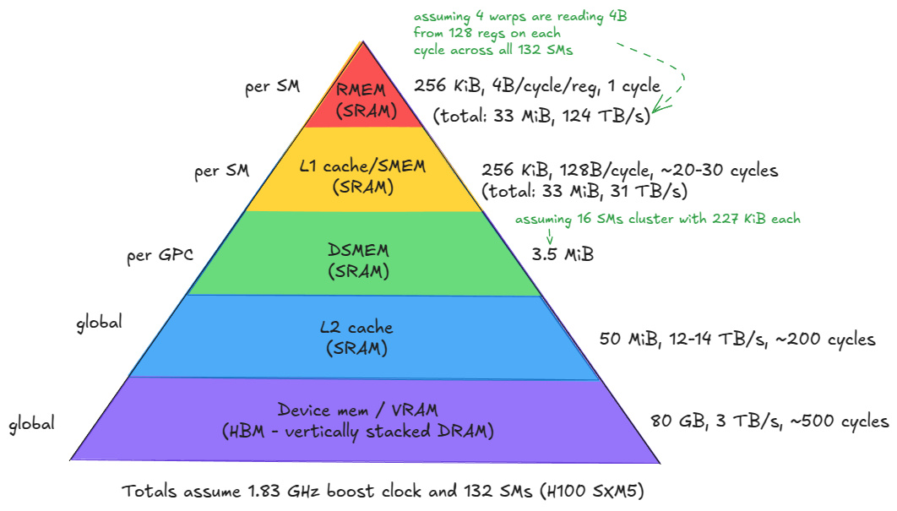
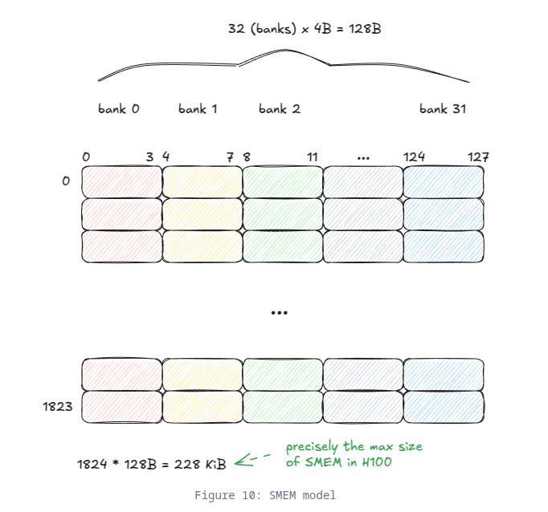
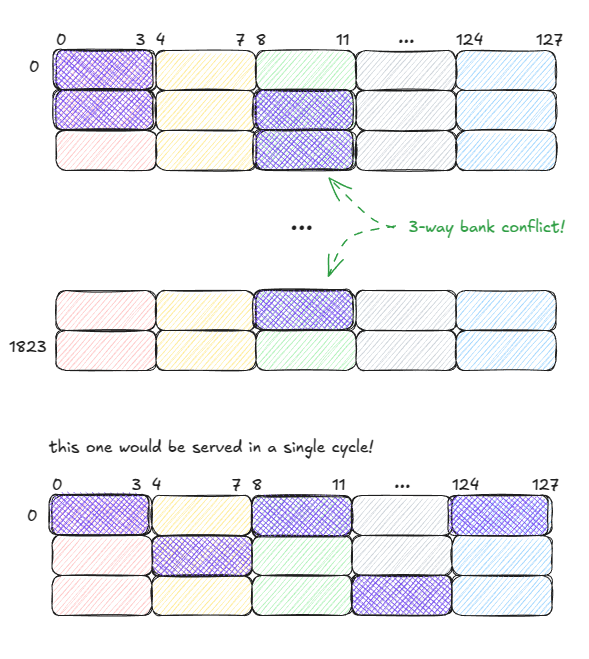
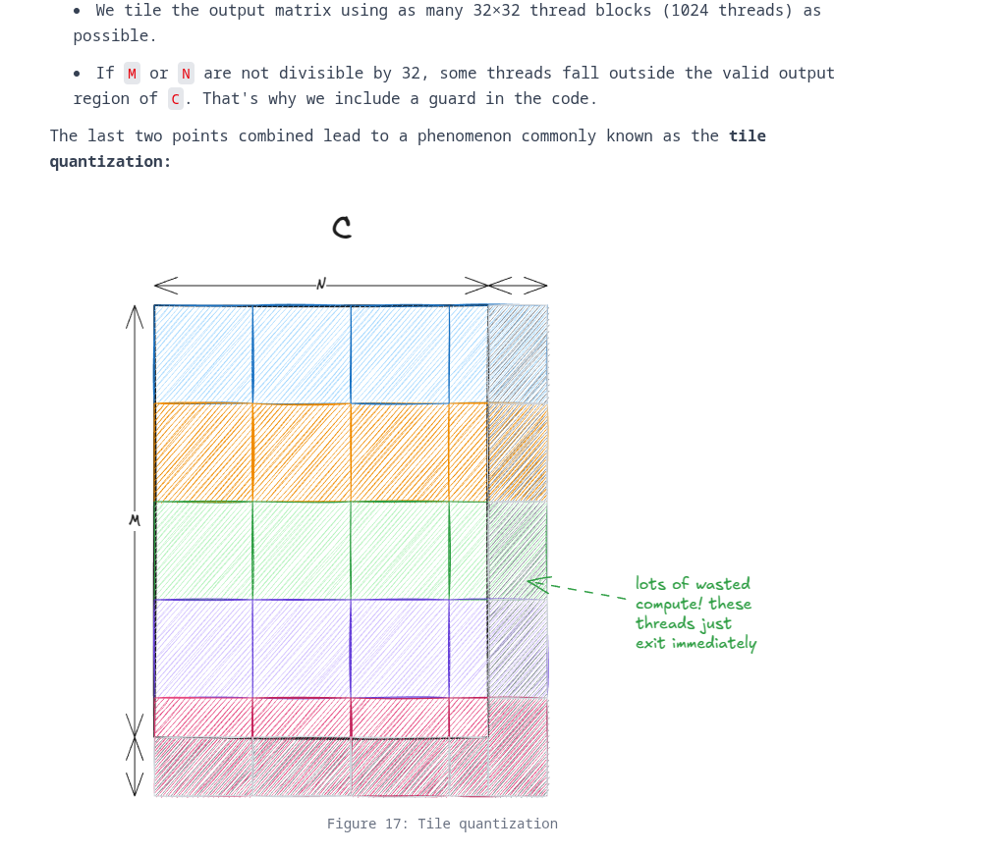

### memory

# ref - https://www.aleksagordic.com/blog/matmul


the GPU memory system consists of:

1. device memory (VRAM) - off-chip DRAM physically separate from the GPU die but packaged together on the same board—implemented as stacked HBM. It hosts global memory (GMEM), per-thread "local" memory (register spill space), etc.

2. l2 cache - a large, k-way set-associative cache built from SRAM. It is physically partitioned into two parts; each SM connects directly to only one partition and indirectly to the other through the crossbar.

3. distributed shared memory (DSMEM). The pooled shared memories (SMEM) of a physically close group of SMs (a GPC).

4. l1 cache and shared memory
 - l1 cache. A smaller, k-way set-associative SRAM cache private to each SM.
 - shared memory (SMEM). Programmer-managed on-chip memory. SMEM and L1 share the same physical storage, and their relative split can be configured in software.

5. register file (RMEM). The fastest storage, located next to the compute units. Registers are private to individual threads. Compared to CPUs, GPUs contain far more registers, and the total RMEM capacity is of the same size as the combined L1/SMEM storage.




as we move from device memory to the register, you can see bandwith go up, latency go down and size go down. so keep the freq accessed data close to the chip


note - *tensor memory accelerator(TMA)* - introduced with hopper, enables asynchronous data transfers between global memory and shared memory, as well as across shared memories within a cluster.


### compute

fundamental unit of compute is SM(streaming multiprocessor). each SM contains -

1. tensor cores - specialized units that execute matrix multiplications on small tiles at high throughput. large matrix multiplications are decomposed into many such tile operations, so leveraging them effectively is critical for reaching peak performance.
2. CUDA cores and SFUs. The so called "CUDA cores" execute standard floating-point operations such as FMA (fused multiply-add: c = a * b + c). Special Function Units (SFUs) handle transcendental functions such as sin, cos, exp, log, but also algebraic functions such as sqrt, rsqrt, etc.
3. Load/Store (LD/ST) units. Circuits that service load and store instructions, complementary to the TMA engine.
4. Warp schedulers. each SM contains schedulers that issue instructions for groups of 32 threads (called warps in CUDA). A warp scheduler can issue one warp instruction per cycle.

An SM can issue instructions from at most four warps simultaneously (i.e., 128 threads in true parallel execution at a given cycle).

However, an SM can host up to 2048 concurrent threads (64 warps). These warps are resident and scheduled in and out over time, allowing the hardware to hide memory/pipeline latency. ( in my gpu is just 1024)

In other words, instruction parallelism (how many threads start executing an instruction on a given cycle) is limited to 128 threads per SM at once (4 32-wide warp instructions), while concurrency (how many threads are tracked in the scheduler and eligible to run) extends to 2048 threads.


### speed of light

the max compute throughput of the gpu determined by the physical characteristics of the gpu.

(for my card : rtx 4060 ti)

number of tensor cores = number of SM * number of tensor core per SM
                       = 34 * 4
                       = 136 
one tensor core can do 64 FMA per cycle = 128 Flops (1 FMA = 2 Flops)

peak throughput = maximum clock frequency x number of tensor cores x FLOPs per tensor core per cycle
                = 2595 MHz x 136 x 128
                = 45.3 TFLOPs (fp16 tensor)


a thread block should contain at least 4 warps (128 threads).
Why?
- a thread block is resident on a single SM.
- each SM has 4 warp schedulers so to fully utilize the hardware, you don't want them sitting idle.


1. global memory(gmem)

here the access patterns matter, because of the physics of the dram cells. when people say “GMEM coalescing is very important”, this is what they mean: threads should access contiguous memory locations to minimize the number of DRAM rows touched.

2. shared memory(smem)

these are made of sram cells. smem is organized into 32 banks, each bank 32 bits wide (4 bytes).



SMEM can serve data from all 32 banks (128B) in a single cycle — but only if one rule is respected:

Threads in a warp must not access different addresses within the same bank. Otherwise, those requests are serialized across multiple cycles.

This situation is known as a bank conflict. If N threads access different addresses of the same bank, the result is an N-way bank conflict and the warp’s memory request takes N cycles to complete.



if multiple threads in a warp access the same address within a bank, SMEM can broadcast (or multicast) that value to all of them.


### L1 model

At a high level, the logic flow of the L1 cache is:

1. A warp issues a memory request (either to SMEM or GMEM).
2. Requests enter the MIO pipeline and are dispatched to the LSUIN router.
3. The router directs the request: SMEM accesses are served immediately from the data array, while GMEM accesses move on to the tag-comparison stage.
4. In the tag stage, the GMEM address tags are compared against those stored in the target set to determine if the data is resident in L1.
5. On a hit, the request is served directly from the data array (just like SMEM).
6. On a miss, the request propagates to L2 (and beyond, if necessary, up to GMEM or peer GPU memory). When the data returns, it is cached in L1, evicting an existing line, and in parallel sent back to the requesting warp.

### PTX and SAAS

the native ISa is SAAS.
ptx is the virtual ISA(assembly) for nvidia gpus. the ptx is not directly run but compiled by ptxas into SAAS

#### case study - mat mul kernels

ref `01_matmul.cu`.



A few interesting optimizations happen automatically in hardware when our GMEM accesses are coalesced -
1. (Matrix A) For a warp reading from A, 32 per-thread LDG.32 instructions (all from the same address) are merged into a single warp-level LDG.32, whose result is broadcast to all threads in the warp.
2. (Matrix B) For a warp reading from B, 32 consecutive per-thread LDG.32 instructions are combined into a single 128B warp-level load. This relies on the threads reading along the contiguous dimension. If instead they read down a column (non-contiguous), the hardware would need to issue multiple warp-level instructions.

"32 per-thread LDG.32 instructions" means all 32 threads in the warp each issue a LDG.32 where each thread is trying to load its own 4-byte float from global memory. The warp then has 32 pending loads. 
At this point the hardware looks at the addresses - 
- All the same address (Matrix A case), here issue one transaction, broadcast result to all 32 threads
- 32 consecutive addresses spanning 128B (Matrix B case), here coalesce into one 128B transaction, each thread gets its 4 bytes back.


```
when we launch (4096/32) * (4096/32) = 16,384 thread blocks in total. However, the H100 PCIe only has 114 SMs.

so how many blocks can run concurrently on each SM?

In general, three resources limit concurrency:
1. Registers
2. Shared memory (SMEM)
3. Threads/warps

if the kernel uses 32 registers per thread. With 1024 threads per block, that's 1024×32 = 32,768 registers per block. 
Since each SM has 65,536 registers, this caps us at 2 blocks per SM.

On Hopper (compute capability 9.0), the maximum number of threads per SM is 2048. With 1024 threads per block, that again caps us at 2 blocks per SM.

even if a kernel doesn't explicitly use SMEM, there's always a system-level overhead of 1024B per block. With the default SMEM allocation of 8192 B per SM that would allow up to 8 blocks. (8192/1024)

Putting it all together: max blocks/SM = min(2,2,8) = 2.

So, at any given time, this kernel can have up to 114×2 = 228 thread blocks resident on the GPU.

This means we'll need 16,384 / 228 = ~71.86 so-called waves in order to complete the matmul operation
```


### occupancy

occupancy usually refers to the number of concurrent blocks that can run on an SM. There's also a closely related definition -
Occupancy (warps) - the ratio of active warps to the maximum number of warps per SM.

Here, "active warps" means the warps of a thread block after they've been allocated resources (registers, SMEM, etc.) at launch.

```
just like tile quantization, we also have wave quantization. 

For example, suppose I launch a kernel with 114 blocks (exactly the number of SMs on my H100 PCIe). And suppose we can only run 1 block / SM at the time. With only one block per SM, the kernel finishes in a single wave. Now imagine I increase the launch to 115 blocks. Suddenly, execution time nearly doubles — because we need two waves - yet most of the resources in that second wave sit idle, with only a single block running:
```

