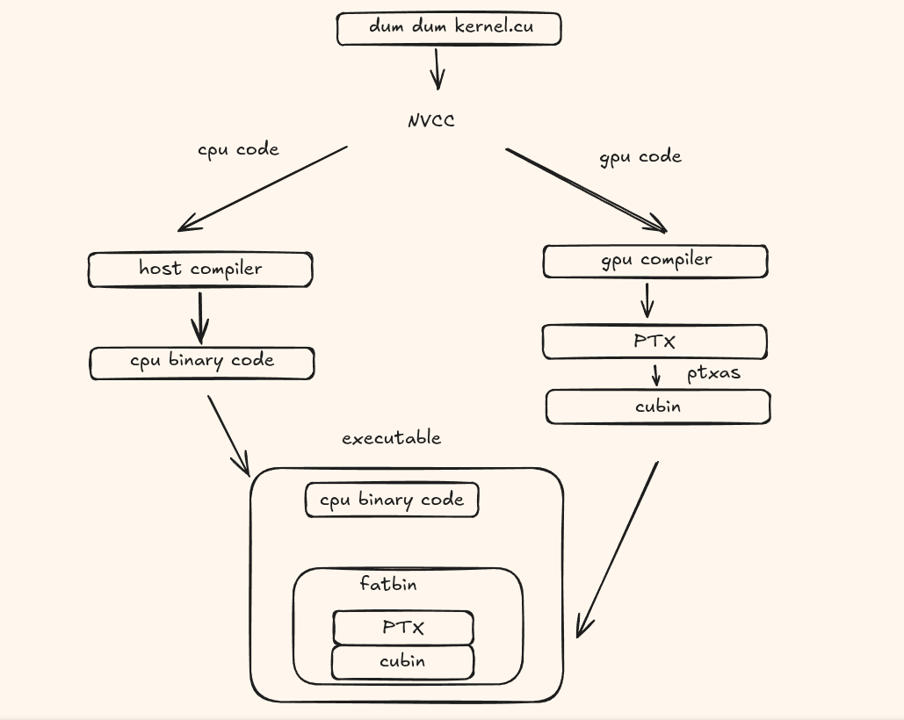

# ptx

a series of experiments to learn to read and write ptx.

reference: https://docs.nvidia.com/cuda/parallel-thread-execution/#ptx-isa-version-9-2

---

## what is ptx?

ptx (parallel thread execution) is nvidia's virtual instruction set architecture (isa). it serves as an intermediate representation between cuda source code and the actual gpu machine code (sass).

think of ptx as a portable, architecture-agnostic assembly language for nvidia gpus. while the actual hardware speaks sass (shader assembly), ptx provides a virtual layer that can be compiled to different gpu architectures.

---

## isa overview

an instruction set architecture (isa) is a specification of the instructions a processor can execute, their format, the behavior of these instructions, and their binary encoding. the human-readable form of an isa is known as assembly.

on nvidia gpus, the native isa is called **sass** (shader assembly).

**ptx** is nvidia's virtual isa-an instruction set for an abstract gpu. ptx code is not executed directly; instead, it is compiled by `ptxas` into the native isa (sass).

---

## compilation pipeline

when you have a cuda file with both device and host code, and this file is compiled using the nvidia cuda compiler `nvcc`, the source code is split into gpu code and cpu code. the gpu code is sent to the gpu compiler, and the cpu code is sent to the host compiler. the host compiler is not part of nvcc. nvcc invokes the host compiler passed in on the command line, or the default compiler on the system.

the compilation process follows two main stages:

1. **nvcc** translates your cuda code to ptx
2. **ptxas** (the ptx assembler) converts ptx to sass (shader assembly), which is the actual machine code for your gpu architecture

```
cuda c++  ->  ptx  ->  sass  ->  execute the kernel
```


---

## compute capability

all nvidia gpus have a version identifier called a **compute capability** (or cc number). each compute capability has a major version number and a minor version number-for example, compute capability 8.6 has a major version of 8 and a minor version of 6.

like other processors, nvidia gpus have specific isas. different generations of gpus have different isas, identified by a version number corresponding to the gpu's compute capability. when compiling the binary (cubin), it is compiled for that specific compute capability.

for example, geforce and rtx gpus of the nvidia ampere generation have a compute capability of 8.6, and their cubin version is **sm_86**. all cubin versions are formatted as `sm_xy`, where x and y correspond to the major and minor numbers of the compute capability.

different generations of nvidia gpus, and even different products within the same generation, may have different isas. this is one of the key reasons for using ptx-it provides a stable virtual isa across different hardware generations.

---

## gpu code compatibility

nvidia gpus are binary-compatible within their major compute capability versions, provided the minor version is the same or higher. this means an sm_86 compiled cubin can be loaded onto any sm_8x gpu where x is greater than or equal to 6.

for example, a cubin compiled for sm_86 (such as the nvidia rtx a4000) can also be loaded and run on sm_89 (such as the nvidia rtx 4000 ada generation). however, it will not load on devices with a compute capability of 8.0 because the minor version is lower than the cubin's target.

nvidia gpus are **not** binary compatible across major compute capability versions. the sm_86 compiled cubin will not load and run on gpus version 9.0 (nvidia hopper architecture) or later.

this compatibility model allows developers to target older hardware while still benefiting from newer gpu features when available.

---

## ptx programming basics

a ptx statement is either a **directive** or an **instruction**.

### directives

directive statements begin with a period (`.`), ensuring they won't conflict with custom identifiers. common directives include:

- `.global` - global memory space
- `.param` - kernel/function parameters
- `.const` - constant read-only memory
- `.align` - memory alignment
- `.reg` - register declarations
- `.shared` - shared memory per cta
- `.local` - local thread memory
- `.func` - function declarations
- `.entry` - kernel entry point

### instructions

an instruction consists of:
- one operator (e.g., `add`, `mov`, `ld`, `st`)
- zero or more operands
- ends with a semicolon (`;`)

operands can be register variables, constant expressions, address expressions, or label names.

instructions have an optional **guard predicate** to control conditional execution, written as `@p` (execute if true) or `@!p` (execute if false), where p is a predicate register.

the instruction follows the pattern: destination operand first, then source operand(s).

example:
```
add.f32 %f1, %f2, %f3;    // f1 = f2 + f3
ld.global.f32 %r1, [%r2]; // load from address in r2 into r1
@%p mov.f32 %f1, %f2;     // conditional move
```

---

## identifiers

ptx identifiers follow c++ rules, with one addition: ptx allows `%` as the first character of an identifier, which helps avoid naming conflicts with reserved words.

ptx predefines several special registers starting with `%`:

| register | description |
|----------|-------------|
| `%tid` | thread id within a thread block |
| `%ntid` | number of threads in the thread block |
| `%ctaid` | thread block id within the grid |
| `%nctaid` | number of thread blocks in the grid |
| `%laneid` | lane id within a warp |
| `%warpid` | warp id within a sm |
| `%smid` | sm id |
| `%gridid` | unique grid id |
| `%clock` | 32-bit clock counter |
| `%clock64` | 64-bit clock counter |
| `%lanemask_eq`, `%lanemask_le`, `%lanemask_lt`, `%lanemask_ge`, `%lanemask_gt` | warp lane mask predicates |
| `%pm0` - `%pm7` | performance monitoring registers |
| `%envreg<n>` | environment registers |

---

## constants

ptx supports integer and floating-point constants, as well as constant expressions used for data initialization and instruction operands. for predicates, integer constants follow c conventions: zero represents false, non-zero represents true.

### integer constants

integer constants are 64 bits long, with both signed (`.s64`) and unsigned (`.u64`) forms. when used for initialization, integers are converted to match the instruction's required length.

supported formats:
- **hexadecimal**: `0x1a2b3c4d` or `0X1A2B3C4D`
- **octal**: `0755`
- **binary**: `0b1010` or `0B1010`
- **decimal**: `1234`

### floating-point constants

floating-point constants are represented as 64-bit double-precision values internally, then converted to the size required by the instruction. they support decimal notation and signed exponents.

hex formats for direct bit representation:
- **single-precision**: `0f3f800000` (represents 1.0)
- **double-precision**: `0d3ff0000000000000`

example:
```
mov.f32 %f1, 0f3f800000;  // load 1.0 into f1
```

### predicate constants

in ptx, integer constants can be used directly as predicates, where zero is false and non-zero is true.

---

## state spaces (memory types)

resources differ across platforms, but the resource types are the same. these are abstracted into ptx storage spaces, each with different characteristics and access methods.

### `.reg` - registers

registers are the fastest storage location. the number of registers is finite-when not enough are available, they overflow into local memory, reducing performance.

- predicate registers: 1 bit
- scalar registers: 8, 16, 32, or 64 bits
- vector registers: 16, 32, 64, or 128 bits

key difference: registers are not addressable, unlike memory locations.

### `.sreg` - special registers

stores predefined, platform-independent registers such as grid, cluster, cta, thread parameters, clock count, and performance monitoring registers. all special registers are predefined and read-only.

### `.const` - constant memory

a read-only space initialized by the host. accessed via `ld.const` directives. the size is strictly limited.

### `.global` - global memory

shared by all threads in all thread blocks. accessed using `ld.global`, `st.global`, and `atom.global` instructions.

### `.local` - local memory

private to each thread. it's a standard memory space with a cache, limited in size, and must be allocated per-thread. accessed using `ld.local` and `st.local`. when compiling with abi, `.local` variables must be declared inside the function.

### `.param` - parameter memory

used to pass input parameters from the host to the kernel. typically used to pass large struct values to a function.

kernel function parameters:
- optional series of parameters per kernel
- read-only variables declared in `.param`
- passed from host to kernel using `ld.param` directive
- shared within a thread block cluster
- can represent normal data or objects in constant, global, local, or shared memory
- can declare pointers with `.ptr` attribute
- function input accessed via `ld.param`, output via `st.param`
- addresses can be assigned to registers using `mov` instruction

### `.shared` - shared memory

addressable memory defined per cta (cooperative thread array), accessible to all threads in that thread block throughout its lifetime. `ld.shared` and `ld.shared::cta` are equivalent unless otherwise specified.

### `.tex` - texture memory

global texture memory (deprecated in newer cuda versions).

---

## data types

### fundamental type specifiers

| category | types |
|----------|-------|
| signed integer | `.s8`, `.s16`, `.s32`, `.s64` |
| unsigned integer | `.u8`, `.u16`, `.u32`, `.u64` |
| floating-point | `.f16`, `.f16x2`, `.f32`, `.f64` |
| bits (untyped) | `.b8`, `.b16`, `.b32`, `.b64`, `.b128` |
| predicate | `.pred` |

### type usage constraints

- `.u8`, `.s8`, and `.b8` data types only support `ld`, `st`, and `cvt` instructions
- `.f16` can only be converted to and from `.f32` and `.f64` types
- `ld`, `st`, and `cvt` instructions allow operands wider than the instruction type, so smaller data can use regular-width registers

### packed data types

ptx supports packing two scalars of the same type into a single, larger value:

- `.f16x2` - two 16-bit floats
- `.bf16x2` - two brain floats

---

## variables

in ptx, a variable combines a type with a storage location. ptx supports scalars, vectors, and arrays.

### variable declarations

```
.global .u32 location;           // global unsigned 32-bit
.reg .s32 index;                 // signed 32-bit register
.const .f32 bias[] = {-1.0, 1.0}; // constant array
.global .u8 buffer[4] = {0, 0, 0, 0}; // global array
.reg .v4 .f32 accel;             // vector of 4 floats
.reg .pred flag1, flag2, flag3;  // predicate registers
```

### vectors

ptx supports vector types with limited lengths - vectors of length 2 and 4, prefixed with `.v2` and `.v4` respectively. vectors must be based on an underlying data type and fit entirely in register space. vectors cannot exceed 128 bits.

### arrays

arrays are used to conserve space. variable initialization only supports `.const` and `.global` variables, defaulting to 0 if not explicitly initialized.

### alignment

storage alignment for addressable variables can be specified when declaring them:

- `.align byte-count` specifies the address must be a multiple of the given byte count
- the value must be a power of 2
- default alignment for scalars and arrays is an integer multiple of the primitive type size
- the default lifetime of a vector variable spans the entire vector size

example:
```
.const .align 4 .b8 bar[8] = {0,0,0,0,2,0,0,0};
```

ptx requires memory accesses to be aligned-the address must be an integer multiple of the access size. for example, `ld.v4.b32` accesses 16 bytes, and `atom.f16x2` accesses 4 bytes.

### parameterized variable names

ptx supports creating a series of variables using a common prefix with an integer suffix:

```
.reg .b32 %r<100>;  // declares %r0, %r1, ..., %r99
```

this convenient syntax works in any storage location.

---

## attributes

variables and functions can have optional attributes specified after the name, separated by commas.

### managed attribute

the `.managed` attribute indicates the variable is stored in unified virtual memory, accessible to both host and device. only usable with `.global` storage locations.

```
.global .attribute(.managed) .s32 global_var;
.global .attribute(.managed) .u64 ptr_var;
```

### unified attribute

the `.unified` attribute indicates the function has the same memory address on both host and device. only usable in device functions or `.global` variables. variables in `.unified` are read-only.

```
.global .attribute(.unified(19,95)) .f32 unified_var;
.func .attribute(.unified(0xAB, 0xCD)) my_function() { ... }
```

the numbers in parentheses represent the section id and offset in unified memory.